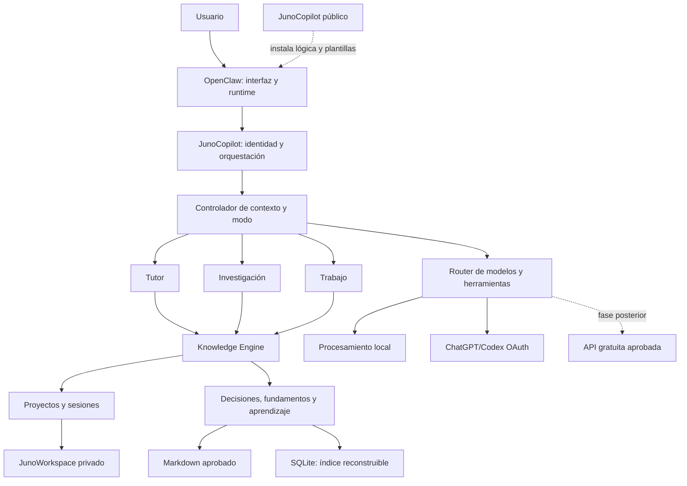

# Arquitectura de JunoCopilot

## 1. Objetivo

Este documento define la arquitectura inicial de JunoCopilot para su MVP: recuperar el contexto de un proyecto, acompañar una sesión de trabajo, capturar información sin interrumpir y conservar un cierre aprobado para la siguiente sesión.

La arquitectura prioriza:

- información legible y controlable por el usuario;
- separación entre producto público y datos privados;
- bajo consumo de almacenamiento;
- trazabilidad;
- permisos mínimos;
- portabilidad respecto de OpenClaw;
- crecimiento progresivo sin diseñar todavía todos los módulos futuros.

## 2. Alcance del MVP

El MVP incluye:

- una única identidad llamada Juno;
- proyectos privados;
- memoria explícita por proyecto;
- objetivo y cierre de sesión;
- captura no interruptiva;
- aprobación de cambios importantes;
- recuperación del estado y próximo paso;
- ChatGPT/Codex mediante OAuth como modelo inicial;
- registro básico de proveedor y actividad.

El MVP no incluye:

- Telegram;
- correo o calendario;
- tutor y repaso espaciado;
- finanzas;
- monitoreo del equipo;
- ejecución de Python, MATLAB o LaTeX;
- comandos del sistema;
- borrado de archivos;
- tareas autónomas o programadas;
- múltiples agentes visibles;
- una interfaz propia.

## 3. Límites del sistema

Juno se divide en tres espacios independientes:

```text
C:\Users\JULIAN\JunoCopilot
    Producto público: código, plantillas, documentación y pruebas.

C:\Users\JULIAN\JunoWorkspace
    Datos privados: proyectos, memoria, sesiones, adjuntos e índices.

C:\Users\JULIAN\.openclaw
    Estado de OpenClaw: configuración, credenciales, sesiones y logs internos.
```

### 3.1 JunoCopilot

Es el proyecto de código abierto y la pieza de portafolio. Contendrá:

- documentación de producto y arquitectura;
- plantillas de memoria y proyectos;
- lógica propia de Juno;
- herramientas e integraciones;
- pruebas y datos ficticios;
- instrucciones de instalación.

Durante el uso normal, Juno no modifica esta carpeta. Los cambios al producto se realizan desde Codex y quedan registrados en Git.

### 3.2 JunoWorkspace

Es el espacio privado y operativo. OpenClaw utilizará esta carpeta como workspace del agente Juno.

Contendrá información personal y académica, por lo que no será un repositorio público. Sus datos podrán respaldarse de forma separada en una fase posterior.

### 3.3 Estado de OpenClaw

`.openclaw` conserva configuración y secretos técnicos. Nunca debe copiarse dentro de JunoCopilot ni publicarse.

Incluye, entre otros:

- `openclaw.json`;
- perfiles OAuth y API keys;
- sesiones originales;
- configuración del Gateway;
- aprobaciones de ejecución;
- logs internos.

## 4. Vista general



## 5. Componentes lógicos

### 5.1 Capa de interacción

En el MVP se utilizará la interfaz local de OpenClaw. Juno se presenta siempre como una única identidad; la separación interna en componentes no aparece como distintos asistentes.

Una identidad única no significa un chat único e infinito. Juno debe admitir varias conversaciones o sesiones independientes:

```text
Juno
├── conversación general
├── sesión de JunoCopilot
├── sesión de turbinas
└── otras sesiones de proyecto
```

La conversación general sirve para consultas, planificación y capturas que todavía no pertenecen claramente a un proyecto. Una sesión de proyecto mantiene un único proyecto activo y carga únicamente su contexto relevante.

Un mismo proyecto puede tener varias sesiones a lo largo del tiempo. Una sesión nueva no necesita conservar el historial completo de las anteriores porque recupera el estado aprobado desde la memoria del proyecto.

La interfaz debe mostrar respuestas breves durante el trabajo y permitir una conversación más abierta durante la reflexión.

### 5.2 Orquestador de Juno

Es la lógica que interpreta la intención del usuario y coordina los demás componentes.

Responsabilidades:

- identificar el proyecto activo;
- aplicar reglas de interacción y aprendizaje;
- decidir si una captura queda pendiente o requiere confirmación;
- solicitar contexto al gestor de memoria;
- elegir una ruta de modelo permitida;
- impedir que el sistema avance más allá del alcance aprobado.

Inicialmente se implementará mediante instrucciones y una capacidad propia integrada con OpenClaw. La forma definitiva —skill, plugin o servicio local— se decidirá durante la implementación del primer prototipo.

### 5.3 Controlador de contexto y modo

Juno utiliza tres modos principales:

| Modo | Objetivo | Comportamiento principal |
|---|---|---|
| Tutor | Favorecer comprensión y retención | Pregunta, da pistas y evita adelantarse |
| Investigación | Explorar y contrastar conocimiento | Busca relaciones, fuentes, evidencia y límites |
| Trabajo | Avanzar y producir resultados | Es directo y automatiza tareas ya comprendidas |

La organización personal es una capacidad transversal y no un cuarto modo. Puede intervenir en cualquiera de los tres sin convertirse en otra identidad.

El modo se decide por turno o por tarea, no necesariamente para toda la conversación. Esto permite pasar rápidamente de trabajar a profundizar en teoría sin abrir otro chat ni perder el proyecto activo.

El funcionamiento predeterminado es `Auto`:

```text
mensaje del usuario
→ Juno infiere la intención
→ selecciona el modo principal
→ muestra una etiqueta breve
→ responde con ese comportamiento
```

La interfaz o la respuesta debe mostrar una etiqueta pequeña:

```text
Tutor · Codex
Investigación · Codex
Trabajo · Local
```

El usuario puede cambiar el modo en lenguaje natural:

- `explicámelo en modo tutor`;
- `ahora solo quiero avanzar`;
- `investiguemos esta relación`;
- `volvé a automático`.

También podrá existir un selector visible cuando haya una interfaz propia. El usuario puede aplicar el cambio a una respuesta, a una tarea o mantenerlo bloqueado durante la sesión.

Cambiar de modo no cambia el proyecto activo. Si la inferencia es ambigua y el comportamiento puede afectar el aprendizaje o producir acciones, Juno debe mostrar su interpretación o pedir confirmación.

### 5.4 Gestor de proyectos

Responsabilidades:

- crear un proyecto desde una plantilla;
- seleccionar el proyecto activo;
- leer su contexto aprobado;
- presentar estado, decisiones, pendientes y próximo paso;
- mantener separados los proyectos;
- verificar la política de privacidad del proyecto.

El proyecto activo pertenece a la sesión, no a la identidad global de Juno. Abrir turbinas en una conversación no debe cambiar silenciosamente el proyecto activo de otra conversación.

### 5.5 Gestor de sesiones

Responsabilidades:

- iniciar una sesión con un objetivo concreto;
- capturar elementos sin interrumpir;
- preparar un cierre breve;
- calcular avance únicamente respecto del objetivo de sesión;
- obtener aprobación;
- dejar un próximo paso exacto.

Cada sesión se clasifica como:

- **general:** sin proyecto activo obligatorio;
- **de proyecto:** asociada a exactamente un proyecto activo.

El usuario puede pedir en lenguaje natural `abrí turbinas` para asociar la sesión actual. Si ya existe trabajo pendiente de otro proyecto, Juno debe proponer cerrarlo o conservarlo antes de cambiar.

La detección automática de inactividad se pospone hasta después de validar el cierre manual.

### 5.6 Knowledge Engine: memoria y trazabilidad

El Knowledge Engine es la capa compartida por Tutor, Investigación y Trabajo. Evita que cada modo mantenga una memoria distinta y permite que un cambio de comportamiento conserve proyectos, fuentes, sesiones y aprendizaje.

Administra:

- proyectos;
- papers y fuentes;
- sesiones;
- decisiones;
- fundamentos;
- aprendizaje;
- relaciones;
- memoria aprobada.

La memoria utiliza un diseño híbrido:

- Markdown para conocimiento importante y legible;
- SQLite para índices, relaciones, búsquedas y estados internos;
- adjuntos originales separados;
- caché regenerable para texto extraído y miniaturas.

La base SQLite no es la única fuente de verdad. Debe poder reconstruirse a partir de los archivos y metadatos aprobados.

### 5.7 Router de modelos

Selecciona una única ruta antes de enviar contexto:

| Nivel | Uso | Costo adicional | MVP |
|---|---|---:|---|
| Local/determinista | Fechas, archivos, validaciones y reglas | 0 | Sí |
| ChatGPT/Codex OAuth | Razonamiento y conversación compleja | 0 mientras haya cuota | Sí |
| API gratuita aprobada | Clasificación y extracción sencilla | 0 con límites | Posterior |
| API paga | Respaldo o capacidades especiales | Variable | Futuro |

El router no debe consultar varios modelos con el mismo contexto salvo solicitud explícita. Cada respuesta mostrará una etiqueta breve como `Local` o `Codex`.

## 6. Estructura de JunoWorkspace

```text
JunoWorkspace/
├── AGENTS.md
├── SOUL.md
├── IDENTITY.md
├── USER.md
├── TOOLS.md
├── inbox/
├── projects/
│   ├── junocopilot/
│   │   ├── PROJECT.md
│   │   ├── STATUS.md
│   │   ├── TODO.md
│   │   ├── DECISIONS.md
│   │   ├── project.yaml
│   │   ├── sessions/
│   │   ├── inbox/
│   │   ├── attachments/
│   │   └── archive/
│   └── turbines/
│       └── ...
├── state/
│   └── juno.db
├── cache/
├── logs/
└── archive/
```

Los archivos bootstrap de OpenClaw se generan desde plantillas versionadas en JunoCopilot, pero las versiones activas pueden contener preferencias personales y permanecen en JunoWorkspace.

## 7. Modelo de memoria de proyecto

La memoria de un proyecto es independiente de los chats. Las conversaciones son espacios temporales de trabajo; los archivos canónicos contienen el estado permanente y aprobado.

```text
uno o más chats del proyecto
→ cierres revisados
→ memoria canónica del proyecto
→ contexto disponible para futuros chats
```

### 7.1 Archivos canónicos

#### `PROJECT.md`

Define el problema, objetivo, alcance, sistema y contexto relativamente estable.

#### `STATUS.md`

Contiene únicamente el estado técnico vigente, último avance aprobado y próximo paso.

#### `TODO.md`

Contiene tareas pendientes con estado, prioridad y relación con hitos.

#### `DECISIONS.md`

Conserva decisiones, fundamentos, fecha y estado. Las decisiones reemplazadas no se borran; se marcan como superadas y se enlazan con su reemplazo.

#### `project.yaml`

Contiene metadatos pequeños y estructurados:

- identificador;
- nombre;
- fecha de creación;
- estado;
- política de privacidad;
- proveedores permitidos;
- rutas externas aprobadas;
- versión del esquema.

### 7.2 Sesiones

Cada sesión confirmada genera un archivo legible con:

- fecha y hora;
- objetivo;
- resultado;
- avance respecto del objetivo;
- decisiones y fundamentos confirmados;
- obstáculos relevantes;
- pendientes nuevos;
- próximo paso.

Las conversaciones completas permanecen en OpenClaw y no se duplican en JunoWorkspace.

### 7.3 Estados de una captura

```text
detectada
→ pendiente
→ aprobada
→ incorporada a memoria
→ superada o archivada
```

Solo el contenido aprobado actualiza los archivos canónicos. Una captura pendiente puede aparecer en el cierre sin alterar todavía el estado oficial.

## 8. Flujo principal del MVP

### 8.1 Abrir un proyecto

```text
Usuario solicita abrir proyecto
→ Juno identifica el proyecto
→ asocia el proyecto a la sesión actual
→ lee project.yaml
→ carga PROJECT, STATUS, TODO y decisiones vigentes
→ consulta el índice si necesita relaciones
→ muestra resumen y próximo paso
```

Juno no carga automáticamente todos los adjuntos ni todas las sesiones históricas.

También puede iniciarse una conversación nueva ya asociada a un proyecto. Ambos caminos producen el mismo estado: una sesión temporal con un proyecto activo y memoria permanente fuera del chat.

### 8.2 Iniciar sesión

```text
Usuario define objetivo
→ Juno comprueba que sea suficientemente concreto
→ registra inicio
→ mantiene proyecto activo
```

### 8.3 Trabajar y capturar

```text
Conversación de trabajo
→ Juno detecta posibles ideas/fundamentos/pendientes
→ los coloca en una bandeja temporal
→ no interrumpe salvo riesgo crítico
```

### 8.4 Cerrar sesión

```text
Usuario solicita cierre
→ Juno compara resultado con objetivo
→ prepara resumen corto
→ muestra elementos por confirmar
→ usuario corrige o aprueba
→ Juno actualiza sesión y memoria canónica
→ reconstruye índices afectados
```

### 8.5 Retomar

```text
Nueva sesión
→ usuario selecciona o solicita el proyecto
→ Juno lee el estado aprobado
→ muestra último avance y próximo paso
→ no depende de releer la conversación anterior
```

### 8.6 Capturas desde una conversación general

Una captura puede indicar su destino explícitamente:

```text
"Para turbinas: investigar materiales flexibles"
→ Juno la asigna al inbox de turbinas
```

Si el proyecto no está claro, Juno conserva la captura en el inbox general para clasificarla después. No debe cambiar el proyecto activo ni interrumpir el trabajo para resolver una ambigüedad menor.

## 9. Privacidad y política de proveedores

Cada proyecto declara uno de estos modos:

### Estándar

- permite proveedores previamente aprobados;
- no pregunta en cada solicitud;
- bloquea secretos y datos críticos;
- envía el contexto mínimo.

### Privado

- limita los proveedores a opciones con una política fuerte aprobada;
- evita APIs gratuitas con condiciones inadecuadas;
- registra cada envío externo.

### Local

- ningún contenido del proyecto sale de la computadora;
- las funciones que requieran modelo externo quedan bloqueadas.

Nunca deben enviarse:

- contraseñas;
- API keys;
- tokens OAuth;
- números completos de tarjetas;
- documentos de identidad;
- credenciales bancarias.

El registro de una operación externa conserva proveedor, modelo, fecha, proyecto, propósito y referencia del contenido utilizado. No debe duplicar el prompt completo salvo que el usuario active explícitamente un modo de depuración.

## 10. Permisos del MVP

| Acción | Política |
|---|---|
| Leer dentro de JunoWorkspace | Permitido |
| Agregar capturas a `inbox/` | Permitido automáticamente |
| Preparar cierres provisionales | Permitido |
| Actualizar archivos canónicos | Requiere aprobación |
| Leer una ruta externa | No disponible en el MVP |
| Escribir fuera de JunoWorkspace | Bloqueado |
| Ejecutar comandos | Bloqueado |
| Borrar o mover archivos | Bloqueado |
| Modificar JunoCopilot | Bloqueado durante uso normal |

El perfil actual `coding` de OpenClaw deberá restringirse antes de utilizar Juno con datos reales. La ejecución del host se configurará inicialmente en modo `deny`.

Las capacidades futuras —MATLAB, Python, monitoreo del sistema, rutas externas o borrado solicitado— se agregarán mediante herramientas explícitas, allowlists y confirmaciones. No amplían los permisos del MVP.

## 11. Almacenamiento

Se establece un presupuesto inicial orientativo de 10 GB para JunoWorkspace:

- aviso al 70 %;
- aviso reforzado al 90 %;
- ningún borrado automático de datos importantes.

Política de retención futura:

- apuntes, papers y fuentes: permanentes;
- fotos temporales verificadas: 30 días antes de revisión;
- cachés y miniaturas: regenerables;
- CAD y simulaciones grandes: referencias a ubicaciones aprobadas, sin duplicación.

## 12. Integración con OpenClaw

La configuración prevista es:

```text
agents.defaults.workspace = C:\Users\JULIAN\JunoWorkspace
gateway.mode = local
gateway.bind = loopback
modelo inicial = OpenAI mediante ChatGPT/Codex OAuth
ejecución del host = deny
```

Los secretos permanecen bajo `.openclaw`. JunoCopilot proporciona plantillas y lógica instalable, pero no almacena credenciales ni sesiones personales.

Antes de activar datos reales se deberá:

1. verificar la versión instalada de OpenClaw;
2. comprobar el inicio de sesión OAuth;
3. revisar el perfil de herramientas efectivo;
4. bloquear ejecución de comandos;
5. revisar `allowInsecureAuth` de la interfaz local;
6. confirmar que el Gateway solo escuche en loopback;
7. ejecutar una prueba con datos ficticios.

## 13. Estrategia de validación

### Prueba interna

JunoCopilot se utiliza como proyecto para comprobar:

- recuperación de contexto;
- objetivos de sesión;
- cierres;
- decisiones reemplazadas;
- continuidad entre sesiones.

### Prueba técnica externa

El proyecto de turbinas comprueba:

- separación de proyectos;
- utilidad con contenido real de ingeniería;
- captura de fundamentos y fuentes;
- preparación de documentación;
- recuperación después de una pausa.

## 14. Decisiones pospuestas

No se cierran todavía:

- lenguaje y estructura interna del núcleo;
- skill, plugin o servicio como forma definitiva de integración;
- esquema completo de SQLite;
- API gratuita inicial;
- backup y cifrado de JunoWorkspace;
- Telegram;
- ejecución de herramientas técnicas;
- monitoreo del equipo;
- acceso a rutas externas;
- borrado recuperable solicitado;
- interfaz propia.

Estas decisiones se tomarán cuando exista un caso de uso validado que las necesite.
